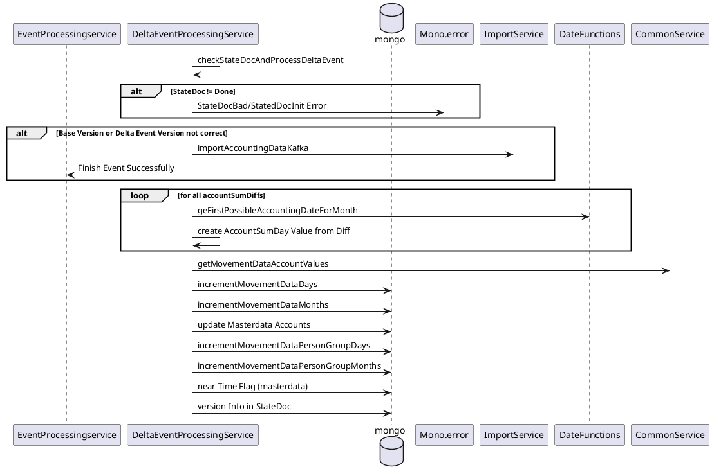

# Personengruppen Berechnung

## Anforderungen 
- Personenkonten sind Konten mit einer 9-stelligen Kontonummer
- Debitoren Konten sind von 100.000.000 - 699.999.999
- Kreditoren Konten sind von 700.000.000 - 999.999.999
- Debitoren Konten sind typisch, wenn der Saldo im Soll größer gleich dem Haben sind
- Kreditoren Konten sind typisch, wenn der Saldo im Haben größer gleich dem Soll sind
- Personenkonten werden an Hand der ersten Nummer der Kontonummer gruppiert
- Für die Gruppierung ermitteln wir die Summenwerte der typischen und der untypischen Konten getrennt. 
- Für die Gruppierung ermitteln wir Tages und Monatsdaten 
- An dem Tag/Monat an dem ein typisches Konto untypisch wird, wird dessen Saldo in der Gruppe aus den typischen Werten ausgebucht (Minusbuchung)
  und in den untypischen Werten eingebucht (Soll oder Haben)
- An dem Tag/Monat an dem ein untypisches Konto typisch wird, wird dessen Saldo in der Gruppe aus den typischen Werten ausgebucht (Minusbuchung)
  und in den untypischen Werten eingebucht (Soll oder Haben)
- Buchungen auf den Konten mit unterschiedlichen Parametern werden gesondert aggregiert (pro Parameter gruppiert)
- Für die typisch / untypisch Betrachtung der Konten ist der Parameter nicht entscheidend   
  => eine evtl. notwendige Umbuchung von typisch auf untypisch muss für alle evtl. vorhandenen Parameter durchgeführt werden.   
  (das gesamte Konto ist typisch oder untypisch)
- Findet auf einem bebuchten Konto eine Generalumkehr statt (mind. ein negativer Buchungswert im Soll oder Haben), dann  wird das Konto nicht mit aggregiert   
  und separat ausgewiesen. Nachfolgende Prozesse müssen dieses Konto einzeln betrachten.  
- Die Bereichsnummer ist irrelevant (solche Buchungen sollte es nicht geben)   
  -> im Code behandelt wie ein abweichender Parameter?

## Ablauf Personengruppen-Berechnung beim InitialImport

```plantuml

ImportService -> ImportService : startImport (consultant, client, fiscalYear, baseVersion, deltaVersion)
ImportService -> MasterdataClient : getMasterDataContext
ImportService -> Mongo : deleteImportData consultant, client, fiscalYear
ImportService -> ImportService : init PersonGroupState (Sets/Maps Group Values...) 
ImportService -> ACDS : getAccountSumDays (aassumption: ordered by account)
loop for every account
ImportService -> CommonService : getMovementDataAccountValues
    loop for every accountSumDay
        CommonService -> CommonService : add to Movement Data Day
        CommonService -> CommonService : add to Movement Data Month 
        alt personAccount can be grouped (accountingReason = 0 and value > 0)
         CommonService -> CommonService : add day value to groupMap
        else 
          CommonService -> CommonService : set eliminationFlag
        end 
    end
    alt elimintationFlagExists
        CommonService -> CommonService : add to individual PersonAccount
    else
        loop for every day
            loop for every accountSumDay in dayList
                CommonService -> PersonGroupAggregationService : addToCreditSum
                CommonService -> PersonGroupAggregationService : addToDebitSum
                CommonService -> CommonService : add day to MonthList with datecorrection
             end
             CommonService -> PersonGroupAggregationService : aagregatePersonGroupsDay
             CommonService -> PersonGroupAggregationService : resetUsualChanged 
         end   
         loop for every month
            activate PersonGroupAggregationService
            loop for every accountSumDay in monthList
                CommonService -> PersonGroupAggregationService : addToCreditSum
                CommonService -> PersonGroupAggregationService : addToDebitSum
                CommonService -> CommonService : addToMonthList with datecorrection
             end
             CommonService -> PersonGroupAggregationService : aagregatePersonGroupsMonth
             CommonService -> PersonGroupAggregationService : resetUsualChanged 
         end    
    end 
    CommonService -> ImportService : movementDataAccountValues
    ImportService -> Mongo : write movementDataDays / months
 end   
 ImportService -> Mongo : write movementDataGroupDays / months
 ImportService -> Mongo : write masterData (individual PersonAccounts)
 ImportService -> Mongo : write masterDataAccounts (usedAccountNumbers) 
```

## Ablauf für Personengruppenberechnung bei einem Delta Event

